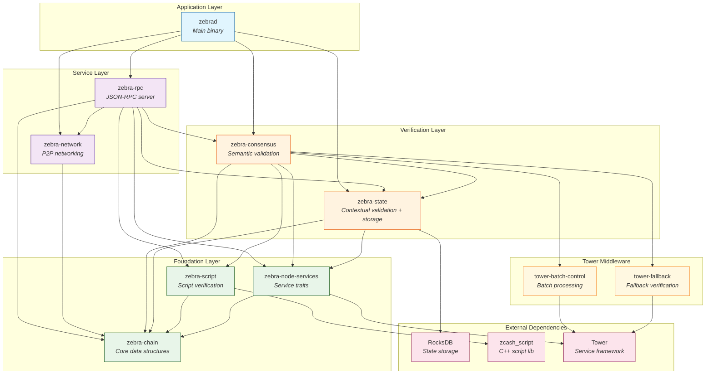
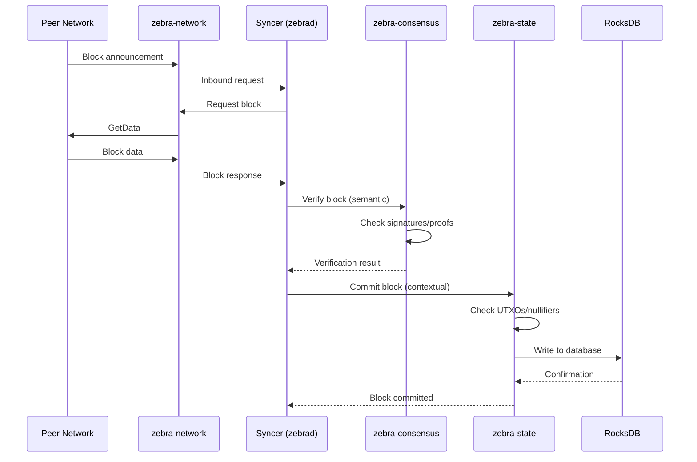

# Crate Architecture

This diagram shows the dependency relationships between Zebra's crates and the data flow through the system.

## Crate Dependency Graph

## Data Flow

## Verification Pipeline

Zebra uses a three-stage verification pipeline for maximum parallelism:

| Stage          | Crate             | What It Checks                       | Parallelizable           |
| -------------- | ----------------- | ------------------------------------ | ------------------------ |
| **Structural** | `zebra-chain`     | Data format, type constraints        | Yes (at parse time)      |
| **Semantic**   | `zebra-consensus` | Signatures, proofs, scripts          | Yes (batch verification) |
| **Contextual** | `zebra-state`     | UTXO set, nullifier set, chain rules | Partially (per-block)    |

## Crate Responsibilities

### Core Crates

| Crate             | Lines of Code | Primary Responsibility                                 |
| ----------------- | ------------- | ------------------------------------------------------ |
| `zebra-chain`     | ~40K          | Block, Transaction, Address definitions; serialization |
| `zebra-consensus` | ~13K          | Signature/proof verification; checkpoint sync          |
| `zebra-state`     | ~35K          | RocksDB storage; UTXO/nullifier tracking               |
| `zebra-network`   | ~26K          | Peer connections; protocol translation                 |
| `zebra-rpc`       | ~17K          | JSON-RPC methods; mining block templates               |
| `zebrad`          | ~20K          | Service orchestration; configuration                   |

### Supporting Crates

| Crate                 | Purpose                                                  |
| --------------------- | -------------------------------------------------------- |
| `zebra-script`        | Wraps `zcash_script` C++ library for transparent scripts |
| `zebra-node-services` | Shared trait definitions (Mempool, BoxError)             |
| `zebra-test`          | Test vectors, mock services, test utilities              |
| `zebra-utils`         | CLI tools: checkpoint generator, OpenAPI generator       |
| `tower-batch-control` | Automatic batching for verification requests             |
| `tower-fallback`      | Falls back to single verification on batch failure       |

## See Also

- [Service Dependencies Diagram](./service-dependencies.svg) - Runtime service interactions
- [Network Architecture](./zebra-network.md) - Detailed network design
- [Mempool Architecture](./mempool-architecture.md) - Transaction pool design
- [Design Overview](../overview.md) - High-level architecture description
